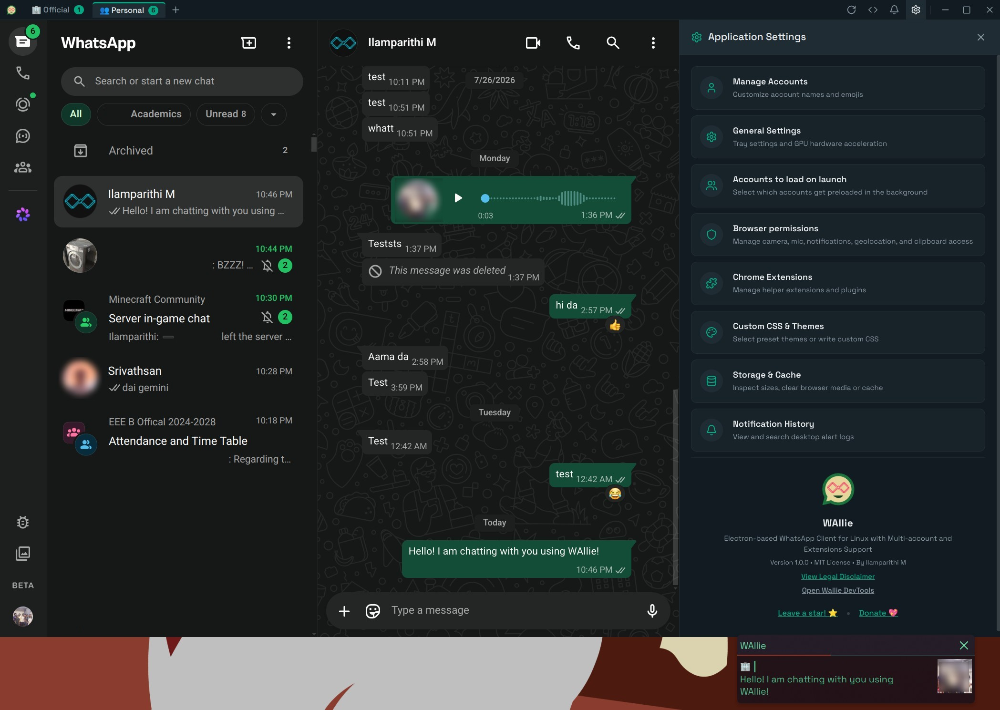

<!--
othneildrew/Best-README-Template
-->
<a id="readme-top"></a>

<!-- PROJECT SHIELDS -->
<!--[![Contributors][contributors-shield]][contributors-url]-->
[![Forks][forks-shield]][forks-url]
[![Stargazers][stars-shield]][stars-url]
[![Issues][issues-shield]][issues-url]
[![project_license][license-shield]][license-url]
[![CI Build][ci-shield]][ci-url]

<!-- PROJECT LOGO -->
<br />
<div align="center">
  <a href="https://github.com/ilamparithi-in/WAllie">
    
  </a>

<h3 align="center">WAllie</h3>

  <p align="center">
    Electron-based WhatsApp Client for Linux with Multi-account and Extensions Support
    <br />
    <!--a href="https://github.com/ilamparithi-in/WAllie"><strong>Explore the docs »</strong></a>
    <br />
    <br />
    <a href="https://github.com/ilamparithi-in/WAllie">View Demo</a>
    &middot;-->
    <a href="https://github.com/ilamparithi-in/WAllie/issues/new?labels=bug&template=bug_report.md">Report Bug</a>
    &middot;
    <a href="https://github.com/ilamparithi-in/WAllie/issues/new?labels=enhancement&template=feature_request.md">Request Feature</a>
  </p>
</div>


<!-- TABLE OF CONTENTS -->
<!-- <details>
  <summary>Table of Contents</summary>
  <ol>
    <li>
      <a href="#about-the-project">About The Project</a>
      <ul>
        <li><a href="#built-with">Built With</a></li>
      </ul>
    </li>
    <li>
      <a href="#getting-started">Getting Started</a>
      <ul>
        <li><a href="#prerequisites">Prerequisites</a></li>
        <li><a href="#installation">Installation</a></li>
      </ul>
    </li>
    <li><a href="#usage">Usage</a></li>
    <li><a href="#roadmap">Roadmap</a></li>
    <li><a href="#contributing">Contributing</a></li>
    <li><a href="#license">License</a></li>
    <li><a href="#contact">Contact</a></li>
    <li><a href="#acknowledgments">Acknowledgments</a></li>
  </ol>
</details> -->


<!-- ABOUT THE PROJECT -->
## About The Project



I was tired of finding Linux clients for WhatsApp which did not do everything I wanted in one place. So I built one, and now I am sharing it with you. Meet **WAllie** (**W**hats**A**pp for **li**nux)!


### Built With

[![Electron][Electron.js]][Electron-url]
[![React][React.js]][React-url]
[![TypeScript][TypeScript]][TypeScript-url]
[![Vite][Vite.js]][Vite-url]
[![TailwindCSS][TailwindCSS]][Tailwind-url]
[![Node.js][Node.js]][Node-url]

<p align="right">(<a href="#readme-top">back to top</a>)</p>

<!-- FEATURES -->
## Features

- 👤 **Multi-Account Session Isolation**: Run multiple WhatsApp accounts concurrently. Each tab runs inside an isolated, persisted session partition (`session.fromPartition('persist:account_<id>')`), preventing cookies, storage, and cache overlap.
- 🧩 **Chrome Extensions Support**: Install Chrome Extensions (e.g. Privacy Extension, WA Web Plus) directly from the Chrome Web Store, or load unpacked extensions from local folders.
- 🔔 **Smart Notifications with Linux Integration**: Receive native desktop notifications tagged with account-specific emojis (in case of multiple accounts). Logs notification history locally with full search capabilities.
- 🔗 **Handle WhatsApp URIs**: Open WhatsApp chat directly by passing the phone number or `wa://` links to the app. Choose which account to use to open the chat.
- 📌 **PIP for Video Calls**: Pin the call pop-out window to the top, so it stays on top of all other windows while you work or chat.

<p align="right">(<a href="#readme-top">back to top</a>)</p>

<!-- GETTING STARTED -->
## Installing WAllie

WAllie can be compiled and installed on most popular Linux distributions. Since it is an Electron app, you can even build it for macOS and Windows. Grab the latest release from the [releases](https://github.com/ilamparithi-in/WAllie/releases) page, or build it from source:

### Prerequisites

Ensure you have Node.js (v18+) and npm installed:
```bash
# Verify installation
node -v
npm -v
```

Start by cloning the repo and installing dependencies:
```bash
# Clone the repository
git clone https://github.com/ilamparithi-in/WAllie.git
cd WAllie

# Install dependencies
npm install

# Build the project
npm run build
```

### 1. Arch Linux
The repository includes a ready-to-use `PKGBUILD` for Arch users. To build and install:
```bash
# Compile and install package using makepkg
makepkg -si
```

### 2. Debian / Ubuntu (APT)
To package WAllie as a `.deb` installer:
```bash
# Generate Debian package
npx electron-builder --linux deb

# Install the package
sudo dpkg -i dist-pack/wallie_*.deb
# Or using apt to automatically resolve local dependencies
sudo apt install ./dist/wallie_*.deb
```

### 3. Fedora / CentOS / RHEL (RPM)
To package WAllie as an `.rpm` package:
```bash
# Generate RPM package
npx electron-builder --linux rpm

# Install the package
sudo dnf install ./dist-pack/wallie-*.rpm
```

### 4. Universal AppImage
If you prefer not to install the package system-wide:
```bash
# Generate AppImage
npx electron-builder --linux AppImage

# Make executable and run
chmod +x dist-pack/WAllie-*.AppImage
./dist-pack/WAllie-*.AppImage
```

### 5. Flatpak
WAllie can be packaged as a Flatpak bundle. Ensure you have Flatpak and Flatpak Builder installed:
```bash
# Build Flatpak bundle using electron-builder
npx electron-builder --linux flatpak

# Run WAllie
flatpak run dist-pack/WAllie_*.flatpak

# or Install it
flatpak install --user ./dist-pack/WAllie_*.flatpak
```

### For Windows and macOS
Though made for Linux, WAllie can be built for Windows and mac as well. Use electron-builder:
```bash
# Generate Windows installer
npx electron-builder --win nsis

# Or generate a portable .exe
npx electron-builder --win portable

# Generate macOS installer
npx electron-builder --mac dmg

# Or generate a macOS app
npx electron-builder --mac zip
```

<p align="right">(<a href="#readme-top">back to top</a>)</p>


<!-- DISCLAIMER -->
## Important Legal Disclaimer

**WAllie is an unofficial, third-party client wrapper for WhatsApp Web.** 

- **No Affiliation**: This project is not affiliated, associated, authorized, endorsed by, or in any way officially connected with WhatsApp LLC, Meta Platforms, Inc., or any of their subsidiaries or affiliates. The official WhatsApp website can be found at [https://whatsapp.com](https://whatsapp.com).
- **Limitation of Liability**: All operations and actions performed on this client are the sole responsibility of the user. The developers and contributors of this application are not liable for any data loss, settings disruptions, or other issues arising from the use of this software.
- **Terms of Service**: WAllie is a standard client wrapper that loads the official WhatsApp Web interface. It does not use any automation, spamming, or scraping APIs. You are responsible for ensuring your usage adheres to WhatsApp's Terms of Service.

<p align="right">(<a href="#readme-top">back to top</a>)</p>


<!-- CONTACT -->
## Discuss

[GitHub Discussions](https://github.com/ilamparithi-in/WAllie/discussions)

[Discord](https://discord.gg/XK3AKb7)

## Donate
Like my work? Consider buying me a Biriyani! [Donate](https://pseudosmp.github.io/donate)

<p align="right">(<a href="#readme-top">back to top</a>)</p>


<!-- MARKDOWN LINKS & IMAGES -->
<!-- https://www.markdownguide.org/basic-syntax/#reference-style-links -->
[contributors-shield]: https://img.shields.io/github/contributors/ilamparithi-in/WAllie.svg?style=for-the-badge
[contributors-url]: https://github.com/ilamparithi-in/WAllie/graphs/contributors
[forks-shield]: https://img.shields.io/github/forks/ilamparithi-in/WAllie.svg?style=for-the-badge
[forks-url]: https://github.com/ilamparithi-in/WAllie/network/members
[stars-shield]: https://img.shields.io/github/stars/ilamparithi-in/WAllie.svg?style=for-the-badge
[stars-url]: https://github.com/ilamparithi-in/WAllie/stargazers
[issues-shield]: https://img.shields.io/github/issues/ilamparithi-in/WAllie.svg?style=for-the-badge
[issues-url]: https://github.com/ilamparithi-in/WAllie/issues
[license-shield]: https://img.shields.io/github/license/ilamparithi-in/WAllie.svg?style=for-the-badge
[license-url]: https://github.com/ilamparithi-in/WAllie/blob/master/LICENSE.txt
[linkedin-shield]: https://img.shields.io/badge/-LinkedIn-black.svg?style=for-the-badge&logo=linkedin&colorB=555
[linkedin-url]: https://linkedin.com/in/linkedin_username
[product-screenshot]: .github/assets/screenshot.jpeg
[ci-url]: https://github.com/ilamparithi-in/WAllie/actions/workflows/build.yml
<!-- Shields.io badges -->
[Electron.js]: https://img.shields.io/badge/Electron-47848F?style=for-the-badge&logo=electron&logoColor=white
[Electron-url]: https://www.electronjs.org/
[React.js]: https://img.shields.io/badge/React-20232A?style=for-the-badge&logo=react&logoColor=61DAFB
[React-url]: https://reactjs.org/
[TypeScript]: https://img.shields.io/badge/TypeScript-3178C6?style=for-the-badge&logo=typescript&logoColor=white
[TypeScript-url]: https://www.typescriptlang.org/
[Vite.js]: https://img.shields.io/badge/Vite-646CFF?style=for-the-badge&logo=vite&logoColor=white
[Vite-url]: https://vitejs.dev/
[TailwindCSS]: https://img.shields.io/badge/Tailwind_CSS-38B2AC?style=for-the-badge&logo=tailwind-css&logoColor=white
[Tailwind-url]: https://tailwindcss.com/
[Node.js]: https://img.shields.io/badge/Node.js-43853D?style=for-the-badge&logo=node.js&logoColor=white
[Node-url]: https://nodejs.org/
[ci-shield]: https://img.shields.io/github/actions/workflow/status/ilamparithi-in/WAllie/build.yml?style=for-the-badge